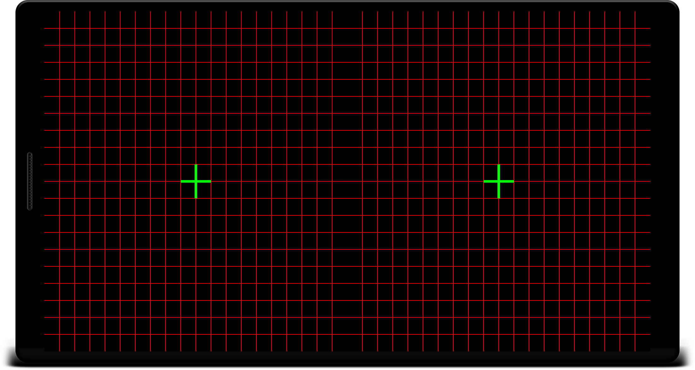
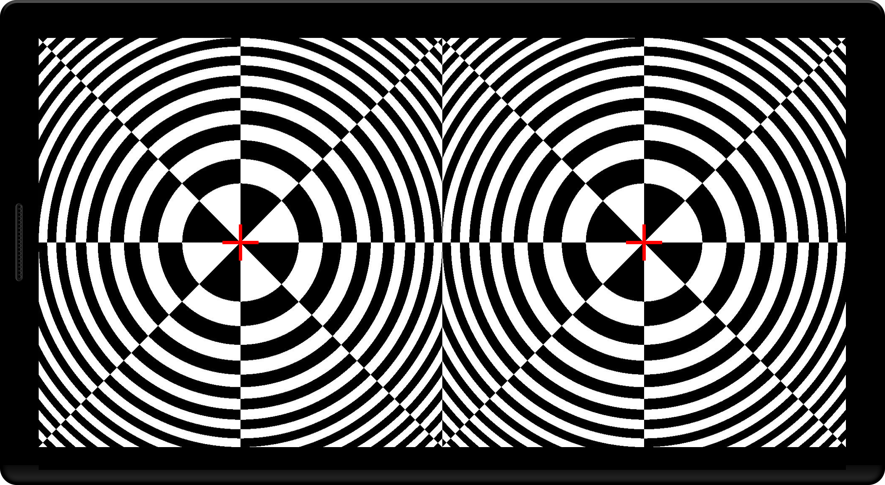
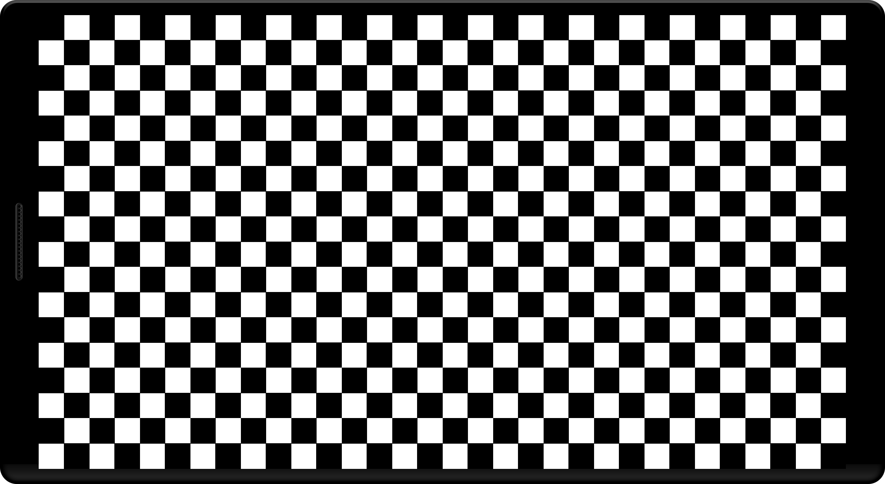

# CalibrationGrid
> Tool for calibration.

Calibration Grid is used to test and correct distortion on the Android platform. Support single view and double views (for VR mode).
Grid can be customized by setting size, color, thickness, etc.

Rendered using OpenGL ES 2.0.

## Screenshots

## Meta

Zebin Xu - zebinxu7@gmail.com
